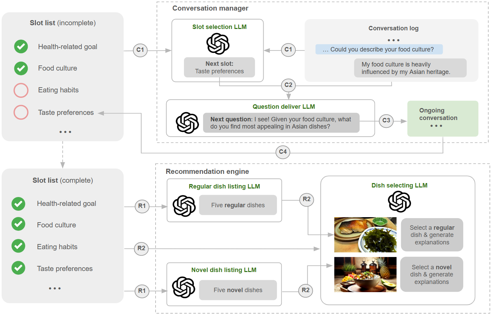

## Backend of SmartEats based on Multi-LLM workflow [📎[cui-25-short paper](https://yuhanlolo.github.io/me/papers/cui25-multi-llm-liang.pdf)]
This repo includes the backend of a conversational dietary recommender system powered by a multi-LLM workflow. The workflow is pre-defined (see the figure below).

 

**🍱 The entrance of this project is `/Central/apifilesm.py`**

**🍝 The project structure is described as follows:**
- `Central`: apis connecting to the frontend;
- `Controllers`: integrating components to form functions;
- `Components` & `Upgrades`: LLM units;
- `DAO`: crud functions connecting to the database;
- `fixedSentences.py`: pre-defined sentences;
- `topicTreesm.py`: a tree structure for interaction flow control.

**🥠 What you need to configure:**
- OpenAI api-key;
- Firebase credentials under `/DAO`;
- Database urls in `/DAO/dbops.py`.
